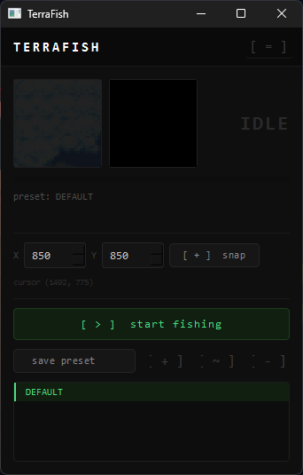
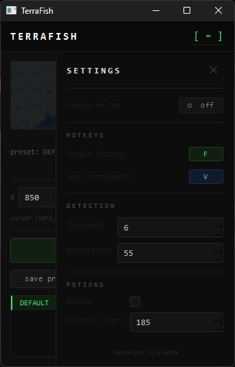

# TerraFish 🎣

Simple auto-fishing tool for Terraria.  
Detects bobber movement on screen and clicks automatically, so you can fish AFK without constantly watching the game.

---

## Features

- Detects bobber movement using screen capture
- Automatically reels in and recasts
- Snap coordinates to cursor position
- Always-on-top window mode
- Hotkey support (start/stop without switching windows)
- Multiple presets for different fishing spots
- Optional auto potion usage

---

## Usage

1. Download `TerraFish.exe` from [Releases](../../releases)
2. Run it
3. Move your cursor over the bobber in-game
4. Press **V** to snap the coordinates to your cursor
5. Press **F** to start fishing
6. Press **F** again to stop

---

## Screenshot

---

## Notes

- Windows only
- Works best in windowed or borderless windowed mode
- The app window can be set to always-on-top via the settings panel (`[ = ]`)

---

## Credits

Based on original work by [alexesmet](https://github.com/alexesmet/terraria-auto-fisher)  
Redesigned and updated by [ZephyrousInCode](https://github.com/ZephyrousInCode)

---

## Version

`v1.0 beta`
